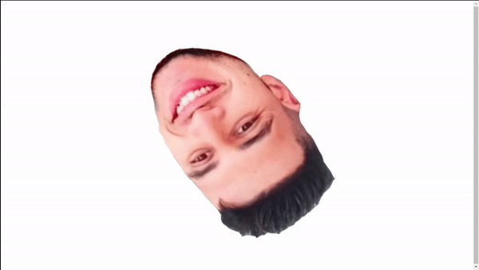

# 🌀 My-Head — Interactive GSAP Showcase & GitFlow

[](https://lucas280507.github.io/My-Head/)
[](https://github.com/lucas280507/My-Head)
[](https://greensock.com/)
[](https://getbootstrap.com/)

> Projeto prático desenvolvido para a disciplina de **Projeto Integrador**, demonstrando o ciclo completo de desenvolvimento com **GitFlow**, **Pull Requests** com templates padronizados, animações interativas em tempo real com **GSAP 3** e deploy automatizado no **GitHub Pages**.

🔗 **Acesse a página publicada:** [https://lucas280507.github.io/My-Head/](https://lucas280507.github.io/My-Head/)

---

## 🚀 Demonstração



---

## ✨ Funcionalidades Principais

- 🔄 **Animação Contínua com GSAP 3**: Rotação fluida de 360° da cabeça utilizando motor de animação profissional.
- 🎮 **Painel de Controle Interativo**:
  - **Play / Pausar**: Controle de execução em tempo real.
  - **Inverter Direção**: Alternância entre sentido horário e anti-horário.
  - **Multiplicador de Velocidade**: Presets (0.5x, 1.0x, 2.0x, 4.0x Turbo) e slider contínuo.
  - **Filtros Visuais CSS**: Efeitos Neon Cyberpunk, Vintage Sepia, Preto & Branco e Invertido.
  - **Atalhos de Teclado**: `<Espaço>` para pausar/retomar, `<R>` para inverter e `↑` / `↓` para ajustar velocidade.
- 💎 **Interface Glassmorphism Moderna**: Estilo Dark Neon com tipografia personalizada (*Outfit* & *JetBrains Mono*).
- 📱 **Totalmente Responsivo**: Otimizado para smartphones, tablets e desktops.

---

## 🌳 Arquitetura GitFlow

Este projeto segue rigorosamente o padrão **GitFlow**:

```
main (Produção / GitHub Pages)
  │
  └── develop (Integração de Funcionalidades)
       │
       └── feature/personalizar-home (Desenvolvimento de Features)
```

### Regras do Fluxo:
1. Nenhuma alteração direta é feita na `main`.
2. O desenvolvimento de novas funcionalidades ocorre em branches `feature/*` criadas a partir de `develop`.
3. Integração realizada via **Pull Requests** com checklist obrigatório (`.github/PULL_REQUEST_TEMPLATE.md`).
4. Merges validados: `feature/*` ➔ `develop` ➔ `main`.
5. Publicação automática via **GitHub Pages** a partir da branch `main`.

---

## 🛠️ Tecnologias Utilizadas

- **HTML5** semântico
- **CSS3** avançado (Variáveis, Flexbox, CSS Grid, Glassmorphism, Filtros)
- **JavaScript (ES6+)**
- **GSAP 3.12.5 (GreenSock Animation Platform)**
- **Bootstrap 5.3.3 & Bootstrap Icons**
- **Git & GitHub Pages**

---

## 💻 Como Executar Localmente

1. Clone o repositório:
   ```bash
   git clone https://github.com/lucas280507/My-Head.git
   cd My-Head
   ```

2. Abra o arquivo `index.html` em qualquer navegador ou utilize uma extensão como o *Live Server* do VS Code.

---

## 👨‍💻 Autor

- **Lucas** — [@lucas280507](https://github.com/lucas280507)
- Projeto Integrador • 2026
